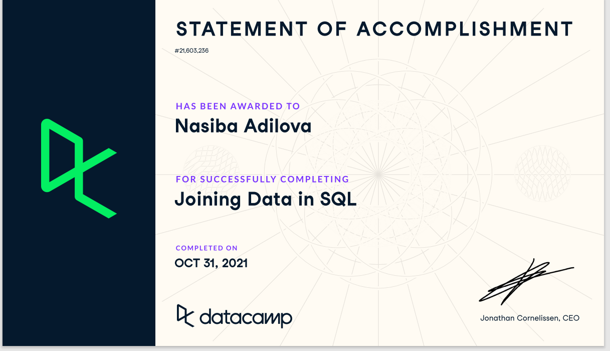
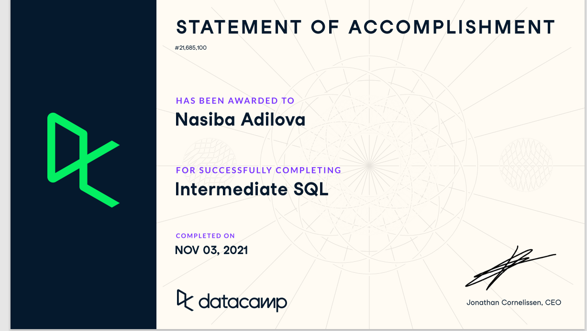

# week_7_homework

1. Create a new column called “status” in the rental table (yes, add a permanent column) that uses a case statement to indicate if a film was returned late, early, or on time.
/*CASE used primarily for handling conditional statements similar to IF-THEN-ELSE in other programming languages. A case statement evaluates the when conditions if found true, returns the THEN part of the statement and ends.*/
SELECT
	return_date,
	rental_date,
	f.rental_duration,

CASE 
	 WHEN (DATE_PART('day', return_date - rental_date) - rental_duration = 0 ) THEN 'on_time'--I used here date_part commandto extract the                                                                                                --- day from rental timestamps so that rental                                                                                                 ---duration could be meaningfull
	 WHEN (DATE_PART('day', return_date - rental_date) - rental_duration > 0 ) THEN 'late'
	 ELSE 'early' END AS status		--- column name 
from film as f
inner join inventory
Using(film_id)
inner join rental
using(inventory_id)

2. Show the total payment amounts for people who live in Kansas City or Saint Louis.
/* To show total payment amount of people who live in Kansaa City or Saint Louis.
first I have to select city,and amount. SUM(amount)is from payment table to get the city I need to join 3 table with match (_id)s.
after join tables. I have to filter with( where) to get the exactly city what we want. and group by city.*/ 

SELECT 
City, SUM(amount)                                       
FROM payment

INNER JOIN customer
ON payment.customer_id = customer.customer_id
INNER JOIN address
ON customer.address_id = address.address_id
INNER JOIN city
ON address.city_id = city.city_id
WHERE city = 'Saint Louis' OR city = 'Kansas City'
GROUP BY (city);

3. How many films are in each category? Why do you think there is a table for category and a table for film category?

SELECT c.name AS categories, COUNT(film.film_id) ---to get the name of categories firts we need to go categary table 

FROM category as c

INNER JOIN film_category as fc
ON c.category_id = fc.category_id      --- to count films we need to film_id. Film_id is in film table to get that we need join the tables.
INNER JOIN film
on fc.film_id = film.film_id            --- categore and film_category and film. group by name of category.
GROUP BY categories

/*
I can think of two reasons why category and and film_category are two separate tables:
1. If a category needs to be renamed, it is only a matter of changing one row in category table as opposed to changing many rows in film_category table.
2. DB owner may decide to give access to one table, but not the other.
In that case, it is helpful to have separate tables to provide restricted access to the data.*/

4. Show a roster for the staff that includes their email, address, city, and country (not ids)

select customer_id, concat(first_name,' ',last_name) as customer_name, email, address, city, country
from customer as c                      --- for firts_name and Last_name I used concat. It will make first_name and Last_name in one column. 
inner join address as a                 --- to show email,adress,city and country in one table we need get those from others tables
on c.address_id = a.address_id
inner join city                          --- for that we need inner join tables.
on a.city_id = city.city_id
inner join country as co
on city.country_id = co.country_id

5. Show the film_id, title, and length for the movies that were returned from May 15 to 31, 2005

SELECT film.film_id, title, length        --

FROM film
INNER JOIN inventory AS i
on film.film_id = i.film_id
INNER JOIN rental AS r 
ON i.inventory_id = r.inventory_id
WHERE return_date 
BETWEEN '05/15/2005' AND '05/31/2005'

6. Write a subquery to show which movies are rented below the average price for all movies
/* to find the answer for this question first we need avg(rental_rate) from film table it is gonna be your subquere.And run it will give you avg(rental_rate) like 2.98.... Then we will select in main quere title ,rental_rate. with "where" clause we can find rental_rate less than avg(rental_rate).*/

select title,rental_rate
from film 
where rental_rate < (               
	select avg(rental_rate)       --- subquere
	from film);

7. Write a join statement to show which movies are rented below the average price for all movies.

select f1.title, f1.rental_rate, avg(f2.rental_rate) 
from film as f1
cross join film as f2
group by f1.title,f1.rental_rate
having f1.rental_rate < avg(f2.rental_rate)

8. Perform an explain plan on 6 and 7, and describe what you’re seeing and important ways they differ.

N-6
EXPLAIN SELECT title,rental_rate   ---explain for subquere shows took lest time then Cross Join to scanned.
FROM film 
WHERE rental_rate < (
	SELECT AVG(rental_rate)
	FROM film);

N-7
EXPLAIN SELECT f1.title, f1.rental_rate, AVG(f2.rental_rate)  --- explain for Cross Join query shows more time-consuming execution with 20K+                                                               ---    rows being scanned. 
                                                              ---   On the other hand, query with Subquery is resulting in smaller cost                                                                 
FROM film AS f1
CROSS JOIN film AS f2
GROUP BY f1.title,f1.rental_rate
HAVING f1.rental_rate < AVG(f2.rental_rate)

9. With a window function, write a query that shows the film, its duration, and what percentile the duration fits into. This may help https://mode.com/sql-tutorial/sql-window-functions/#rank-and-dense_rank

/*
You can use window functions to identify what percentile (or quartile, or any other subdivision) a given row falls into. The syntax is NTILE(*# of buckets*). In this case, ORDER BY determines which column to use to determine the quartiles (or whatever number of 'tiles you specify).*/

SELECT title, rental_duration,               
NTILE(100) OVER (ORDER BY rental_duration)    
FROM film
ORDER BY title,rental_duration

10. In under 100 words, explain what the difference is between set-based and procedural programming. Be sure to specify which sql and python are.

/* Procedural approach is actually the “programmatic approach” that we are used to working with in our daily programming life. In this approach, we tell the system "what to do" along with "how to do" it. We query the database to obtain a result set and we write the data operational and manipulation logic using loops, conditions, and processing statements to produce the final result. The runtime does whatever we want it to do, however we want it to do.*/

/*Set based approach is actually an approach which lets you specify "what to do", but does not let you specify "how to do".
You never have to specify "how" the data retrieval operation has to be implemented internally. You never have to specify how to implement the "joining operation" internally either. Also, you don't have to specify how to apply a filter condition against the rows.The database engine determines the best possible algorithms or processing logic to do these.*/

Bonus:

Find the relationship that is wrong in the data model. Explain why it’s wrong.

